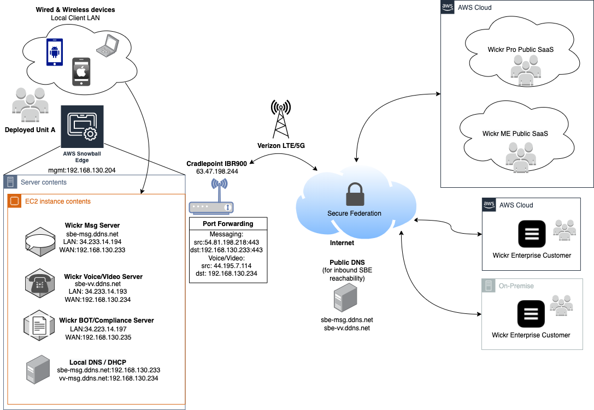

## Deploying Wickr on Snowball Edge

## Architectural Overview

1. Launches three EC2 instances. One for the Messaging server, one for the Voice and Video server, and one for the Compliance server
2. Configures the necessary volumes for each one
3. Installs the appropriate Wickr software

### Instructions
1. Download all files from this repo
2. Edit `launch_ec2.sh` to reflect your environment
3. `chmod +x launch_ec2.sh`
4. `./launch_ec2.sh`

The user will have to go to the browser to finish the setup (http://<ip_address>:8800)
